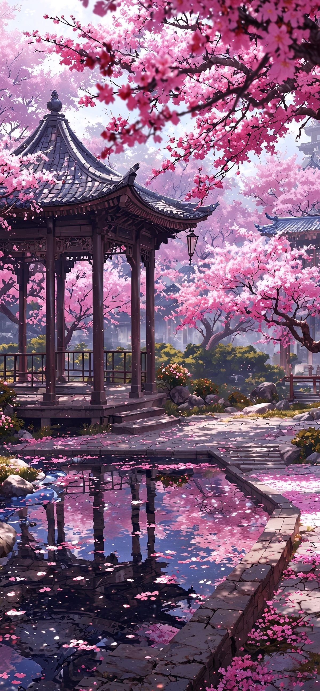
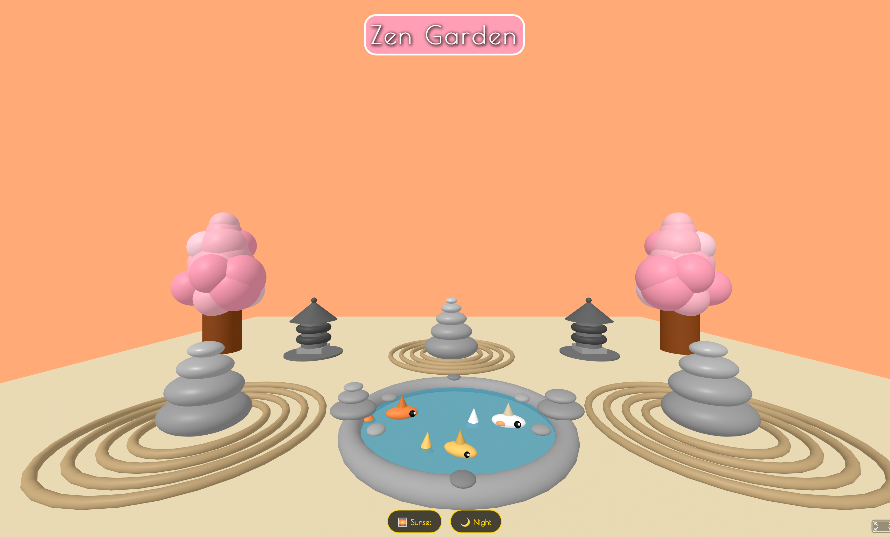
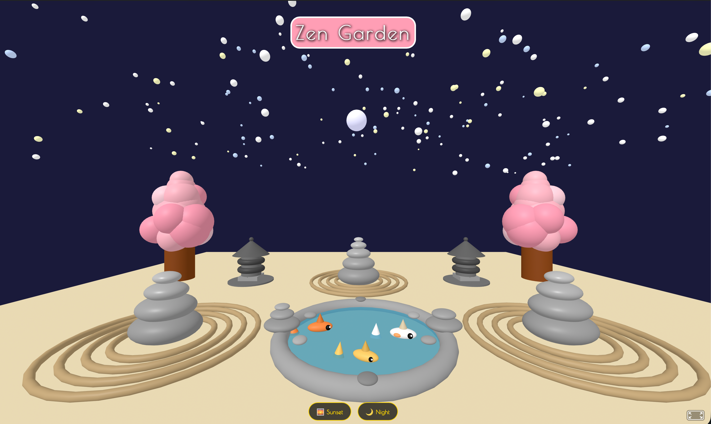
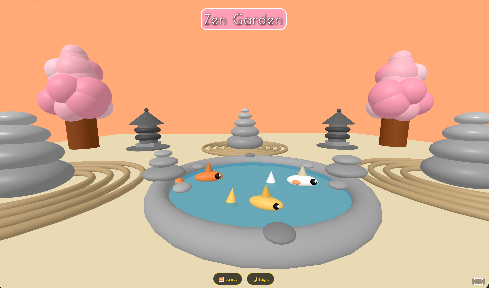

<!-- & This creates a banner for the ReadMe -->

# 
🌸 Zen Garden VR 🌸

## Practice: Creating an immersivr 3D Zen Garden using A-Frame and JavaScript

### Understanding A-Frame -> Bringing a meditative Japanese garden to life in virtual reality.

## 
💫 Overview

-   [ ] This is an interactive 3D VR scene built with A-Frame, featuring a tranquil Zen garden with cherry blossom trees, stone lanterns, a koi pond, meditation stone stacks, and raked sand rings.
-   [ ] Users can switch between Sunset and Night modes using on-screen buttons, changing the sky color, moon visibility, and starfield.

## 
🎨 Key Design Features

-   [ ] <b>Cherry Blossom Trees</b> – Two symmetrical trees on the left and right, constructed from layered pink spheres for a soft, organic canopy.
-   [ ] <b>Stone Lanterns</b> – Traditional Japanese lanterns placed near each tree, built with cylinders, boxes, cones, and torus rings.
-   [ ] <b>Koi Pond</b> – A circular water feature with three colorful koi fish (orange, white-orange, golden) and a stone rim lined with decorative pebbles.
-   [ ] <b>Meditation Stone Stacks (Cairns)</b> – Balanced stone piles of varying heights, placed around the garden to encourage contemplation.
-   [ ] <b>Raked Sand Rings</b> – Concentric torus rings around meditation stones, simulating the classic Zen garden ripple pattern.
-   [ ] <b>Time-of-Day Controls</b> – Sunset mode (warm orange sky) and Night mode (deep blue-purple sky with a glowing moon and twinkling stars).
-   [ ] <b>Flexible Camera Angles</b> – Multiple commented camera positions in the HTML let you preview different garden perspectives (tree-side, lantern-side, pond-side, etc.).
-   [ ] <b>Styled UI Overlay</b> – A semi-transparent "Zen Garden" title and frosted-glass buttons that float elegantly over the 3D scene.

-   [ ] This project demonstrates the power of A-Frame for creating browser-based VR experiences without needing complex WebGL code.
    -   [ ] A-Frame is an open-source web framework for building 3D/VR scenes using HTML-like custom elements.
    -   [ ] It abstracts Three.js into declarative tags like `<a-box>`, `<a-sphere>`, `<a-sky>`, making 3D accessible to web developers.
    -   [ ] The scene becomes interactive with simple JavaScript event listeners.

-   [ ] The visual examples of the webpage:
    -   [ ] The Sunset view with a warm sky
        -   [ ] 
    -   [ ] The Night view with the moon and the stars
        -   [ ] 
    -   [ ] Close-up of the Zen Garden
        -   [ ] 

## 
👩🏾‍💻 Semantic Outline of the webpage

### 
A-Frame Entities (3D Objects)

-   [ ] The `a-camera` element:
    -   [ ] Defines the user's viewpoint. Multiple positions are commented out, allowing you to switch between different garden views.

-   [ ] The `a-sky` element:
    -   [ ] The background (sky). Changes color dynamically via JavaScript for Sunset/Night modes.
-   [ ] The `a-plane` element:
    -   [ ] The ground (sand-colored foundation of the Zen garden).
-   [ ] The Cherry Blossom Trees:
    -   [ ] Built using `<a-cylinder>` for trunks and many `<a-sphere>` elements for pink blossom clusters (bottom, middle, top layers).
-   [ ] The Stone Lanterns:
    -   [ ] Composed of `<a-cylinder>`, `<a-box>`, `<a-cone>`, `<a-torus>`, and `<a-sphere>` to mimic traditional lanterns.
-   [ ] The Meditation Stone Stacks:
    -   [ ] Overlapping `<a-sphere>` elements scaled to look like flat, balanced stones.
-   [ ] Raked Sand Rings:
    -   [ ] `<a-torus>` elements rotated flat on the ground (`rotation="90 0 0"`) to create concentric circles.
-   [ ] Koi Pond:
    -   [ ] A translucent blue `<a-cylinder>` for water, surrounded by a stone `<a-torus>` rim and decorative `<a-sphere>` pebbles.
-   [ ] Koi Fish:
    -   [ ] Grouped `<a-entity>` elements containing `<a-sphere>` bodies, `<a-cone>` tails, fins, and eyes.
-   [ ] Moon & Stars:
    -   [ ] Dynamically created by JavaScript. The moon is a glowing `<a-sphere>`. Stars are 200 tiny spheres scattered in a dome.

## 
✨ HTML Elements (Iverlay)

-   [ ] `
`:
    -   [ ] Fixed-position title bar with "Zen Garden", styled with Poiret One font, pink background, and rounded border.
-   [ ] `
`:
    -   [ ] Container for the two interactive buttons.
-   [ ] `<button>` elements:
    -   [ ] Sunset and Night buttons with hover/active CSS effects (scale, color change, frosted glass).

## 
✨ JavaScript Functionality

-   [ ] `initZenGardenControls()` elements:
    -   [ ] Sets up the time-of-day system.
    -   [ ] Finds `<a-scene>` and `<a-sky>`.
    -   [ ] Cleans up old lights to avoid interference.
    -   [ ] Creates the moon sphere (if not present) and stars group (200 stars).
    -   [ ] Defines `setSunsetMode()` (warm sky, hide moon/stars) and `setNightMode()` (dark sky, show moon/stars).
    -   [ ] Creates the two buttons and appends them to the page.
    -   [ ] Waits for the A-Frame scene to fully load before running.

## 
✨ Encompaassed Technologies

-   [ ] HTML:
    -   [ ] Will be the structure and skeleton of how the app will appear on the webpageWill be the structure and skeleton of how the app will appear on the webpage
-   [ ] CSS:
    -   [ ] Encompass the style of the app and give it some flair
-   [ ] <b>JavaScript:</b>
    -   [ ] The programming language that is the magic behind the scenes that makes webpages react, calculate, and come alive. Turning static pages into conversations.
-   [ ] A-Frame (v1.7.1):
    -   [ ] The core 3D/VR framework. Renders the entire garden, handles camera, lighting, and 3D primitives.
-   [ ] Google Fonts (Poiret One):
    -   [ ] Adds an elegant, minimalist font for the UI overlay.

- [ ] Link to visit the webpage:
  - [ ] <a href="" target="_blank">🌸 Art Gallery: Ancient Visions of Asia 🌸</a>

